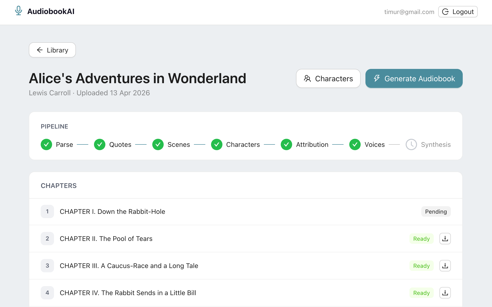
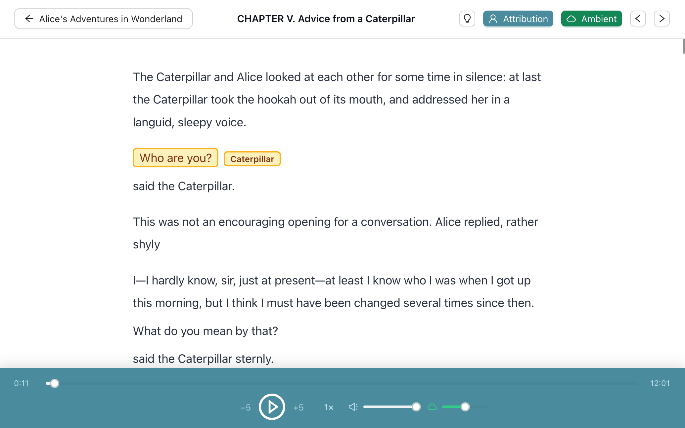
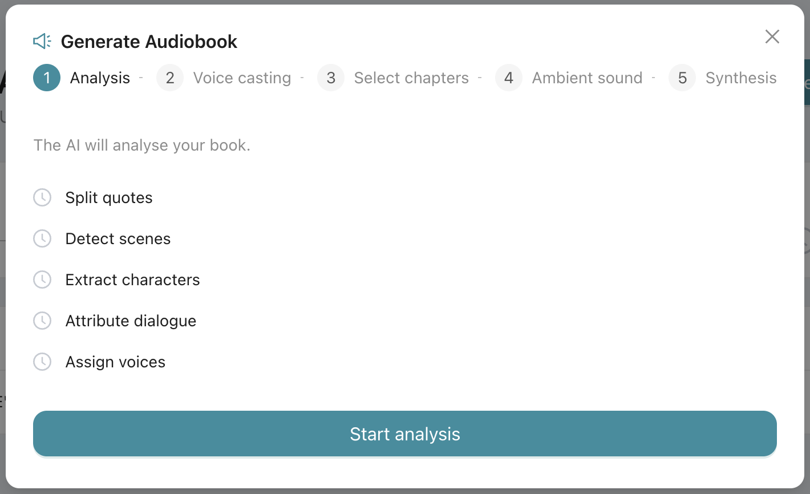
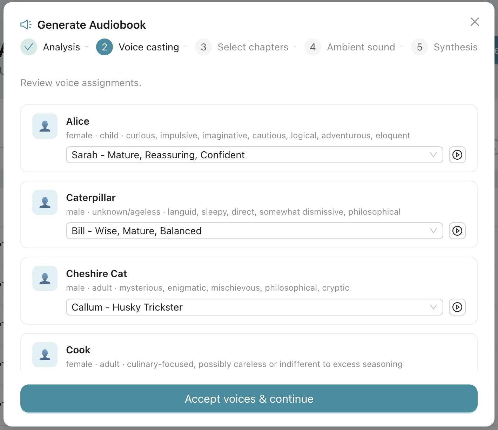
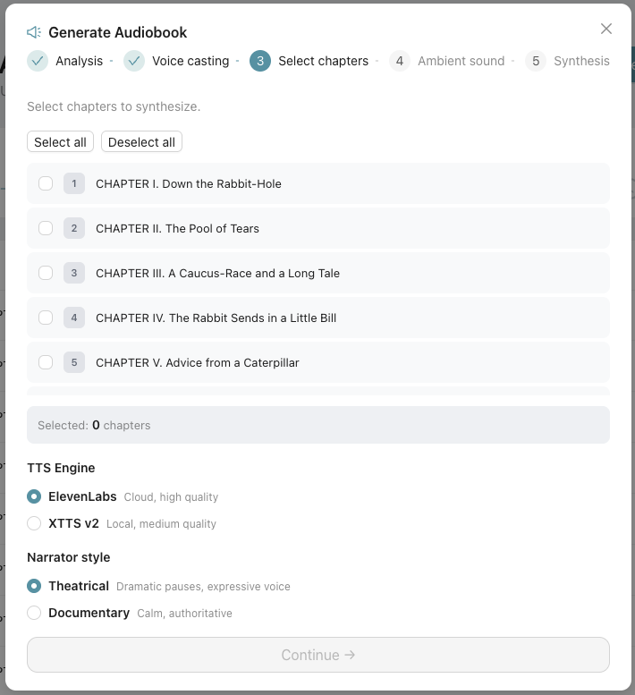
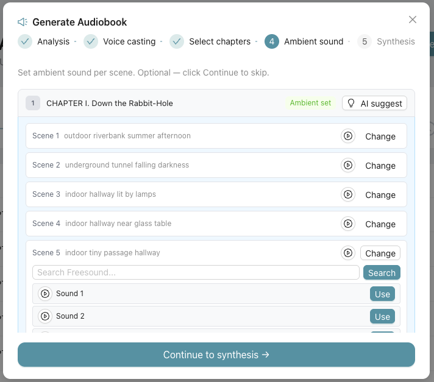

# Creating Audiobooks with AI

A web application that converts EPUB books into multi-voice audiobooks using a 7-step AI pipeline powered by Claude (Anthropic) and ElevenLabs.

---

## Table of Contents

1. [Overview](#overview)
2. [Screenshots](#screenshots)
3. [Pipeline](#pipeline)
4. [Prerequisites](#prerequisites)
5. [Installation](#installation)
6. [Configuration](#configuration)
7. [Running the Application](#running-the-application)
8. [Quick Start](#quick-start)
9. [Project Structure](#project-structure)
10. [License](#license)

---

## Overview

The application takes an EPUB file as input and produces a narrated audiobook where each character speaks in a distinct voice. All AI processing (dialogue detection, character extraction, speaker attribution, voice assignment) runs through the Anthropic Claude API. Audio synthesis is done via ElevenLabs cloud TTS or locally via XTTS v2 (Coqui TTS).

---

## Screenshots

### Library

<p align="center">
  
</p>

<table>
<tr>
<td width="50%">
  
  <p align="center"><sub><b>Pipeline</b> — live status of all 7 processing steps</sub></p>
</td>
<td width="50%">
  
  <p align="center"><sub><b>Chapter reader</b> — synced text highlighting</sub></p>
</td>
</tr>
</table>

### Generate Audiobook — 4-step

<table>
<tr>
<td width="50%">
  
  <p align="center"><sub><b>1 · Analysis</b> — runs quote splitting, scene detection, character extraction & attribution</sub></p>
</td>
<td width="50%">
  
  <p align="center"><sub><b>2 · Voice Casting</b> — assign and preview a voice for every character</sub></p>
</td>
</tr>
<tr>
<td width="50%">
  
  <p align="center"><sub><b>3 · Select Chapters</b> — pick chapters, narrator style, and TTS engine</sub></p>
</td>
<td width="50%">
  
  <p align="center"><sub><b>4 · Ambient Sound</b> — generate scene-based background audio via Freesound</sub></p>
</td>
</tr>
</table>

---

## Pipeline

The book goes through 7 sequential steps after upload:


| Step | Name            | Description                                               |
| ---- | --------------- | --------------------------------------------------------- |
| 1    | **Parse**       | EPUB → chapters and paragraphs stored in SQLite          |
| 2    | **Quotes**      | Split mixed paragraphs into dialogue / narration segments |
| 3    | **Scenes**      | Detect scene boundaries and locations (for ambient sound) |
| 4    | **Characters**  | Extract and profile all characters via LLM                |
| 5    | **Attribution** | Assign a speaker to every dialogue line via LLM           |
| 6    | **Voices**      | Match each character to an ElevenLabs voice via LLM       |
| 7    | **Synthesis**   | Text-to-speech for all paragraphs → final MP3            |

---

## Prerequisites


| Requirement | Version     | Notes                               |
| ----------- | ----------- | ----------------------------------- |
| Python      | 3.11        | Earlier versions are not tested     |
| Node.js     | 18 or newer | Required for the React frontend     |
| npm         | 8 or newer  | Comes with Node.js                  |
| ffmpeg      | any recent  | Required by pydub for audio merging |

### Installing ffmpeg

**macOS (Homebrew):**

```bash
brew install ffmpeg
```

**Ubuntu / Debian:**

```bash
sudo apt install ffmpeg
```

**Windows:**
Download from https://ffmpeg.org/download.html and add to `PATH`.

### API Keys


| Key                  | Required | Purpose                                                              |
| -------------------- | -------- | -------------------------------------------------------------------- |
| `ANTHROPIC_API_KEY`  | Yes      | Quote splitting, character extraction, attribution, voice assignment |
| `ELEVENLABS_API_KEY` | Yes      | Voice synthesis and voice listing                                    |
| `FREESOUND_API_KEY`  | No       | Ambient sound search and download                                    |

- Anthropic: https://console.anthropic.com/
- ElevenLabs: https://elevenlabs.io/
- Freesound: https://freesound.org/apiv2/apply/

---

## Installation

### 1. Create a Python virtual environment

```bash
python3.11 -m venv venv
```

Activate it:

```bash
# macOS / Linux
source venv/bin/activate

# Windows
venv\Scripts\activate
```

### 2. Install Python dependencies

```bash
pip install -r requirements.txt
```

> **Note:** The `TTS` package (Coqui XTTS) is large (~2 GB including model weights). If you only plan to use ElevenLabs for synthesis, you can skip it by commenting out the `TTS` line in `requirements.txt` before installing.

### 3. Install frontend dependencies

```bash
cd frontend
npm install
cd ..
```

---

## Configuration

Copy the example environment file and fill in your API keys:

```bash
cp .env.example .env
```

Open `.env` and set the required values:

```env
ANTHROPIC_API_KEY=sk-ant-...
ELEVENLABS_API_KEY=...

# Optional
FREESOUND_API_KEY=
```

---

## Running the Application

### Terminal 1 — Backend (FastAPI)

```bash
# Activate the virtual environment first
source venv/bin/activate   # Windows: venv\Scripts\activate

uvicorn backend.main:app --reload
```

The API will be available at **http://localhost:8000**.
Interactive API docs: **http://localhost:8000/docs**

### Terminal 2 — Frontend (React + Vite)

```bash
cd frontend
npm run dev
```

The web app will be available at **http://localhost:5173**.

---

## Project Structure

```
Audiobook/
├── backend/                # FastAPI application
│   ├── main.py             # app entry point, CORS, DB init
│   ├── database.py         # SQLAlchemy engine and session
│   ├── models.py           # ORM models (Book, Chapter, Character, …)
│   └── routers/            # REST endpoints
│       ├── books.py        # upload, list, delete, cover, Gutenberg import
│       ├── pipeline.py     # pipeline trigger and status
│       ├── synthesis.py    # synthesis trigger, audio streaming, timestamps
│       ├── voices.py       # voice listing and preview
│       ├── ambient.py      # ambient sound generation and mixing
│       └── auth.py         # register / login (JWT)
├── core/                   # AI pipeline logic (no HTTP, pure Python)
│   ├── parser/             # EPUB parsing → DB records
│   ├── nlp/                # quote splitting, character extraction,
│   │                       #   dialogue attribution, voice assignment
│   ├── audio/              # scene detection and audio merging
│   └── tts/                # ElevenLabs and XTTS synthesis backends
├── frontend/               # React + Vite + Ant Design
│   └── src/
│       ├── pages/          # BooksPage, BookPage, ChapterPage, CharactersPage
│       ├── components/     # GenerateModal, VoicePreview, …
│       └── api/client.js   # Axios API client
├── experiments/            # Evaluation and annotation tools (optional)
│   ├── annotation_tool.py       # CLI for labelling ground-truth speakers
│   ├── evaluate_attribution.py  # accuracy report vs ground truth
│   └── ground_truth/            # manually annotated datasets for evaluation
│       ├── alice_ground_truth.json       # Alice in Wonderland speaker labels
│       └── the_gambler_ground_truth.json # The Gambler speaker labels
├── .env.example            # environment variable template
├── requirements.txt        # Python dependencies
└── README.md               # this file
```

---

## Notes

- The SQLite database (`audiobook.db`) and all generated audio files are created automatically in `storage/` on first run.
- For XTTS local synthesis, a CUDA-capable GPU is strongly recommended; CPU synthesis works but is very slow.

---

## License

MIT — see [LICENSE](LICENSE).
